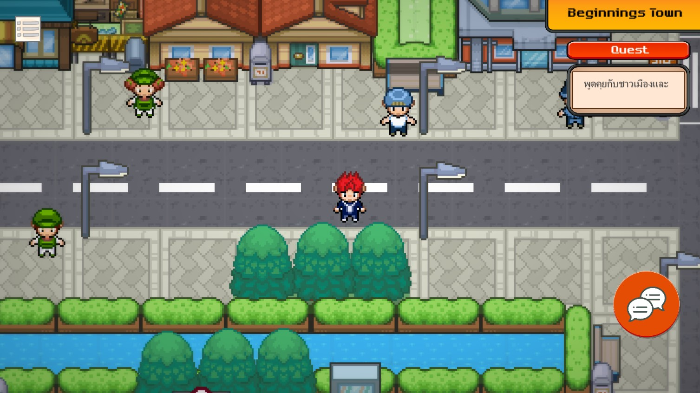
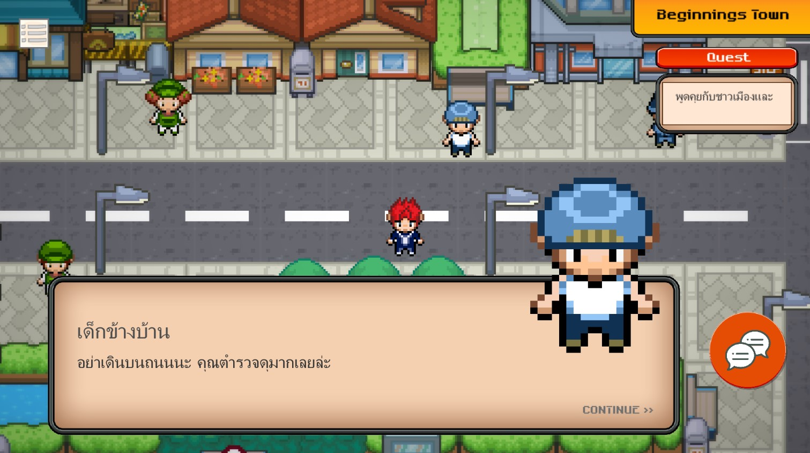
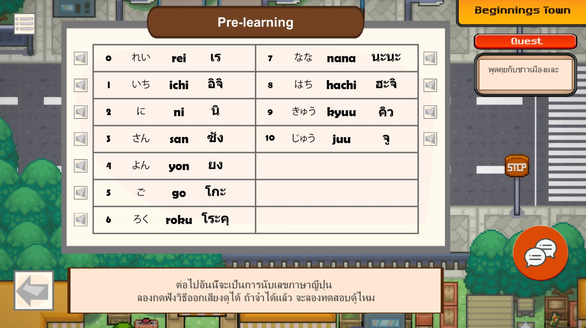
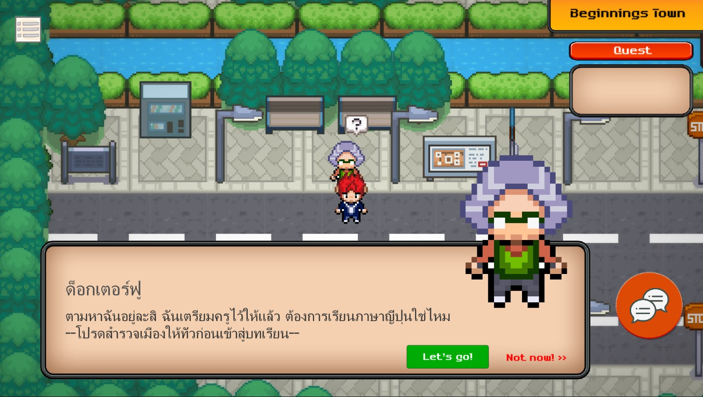
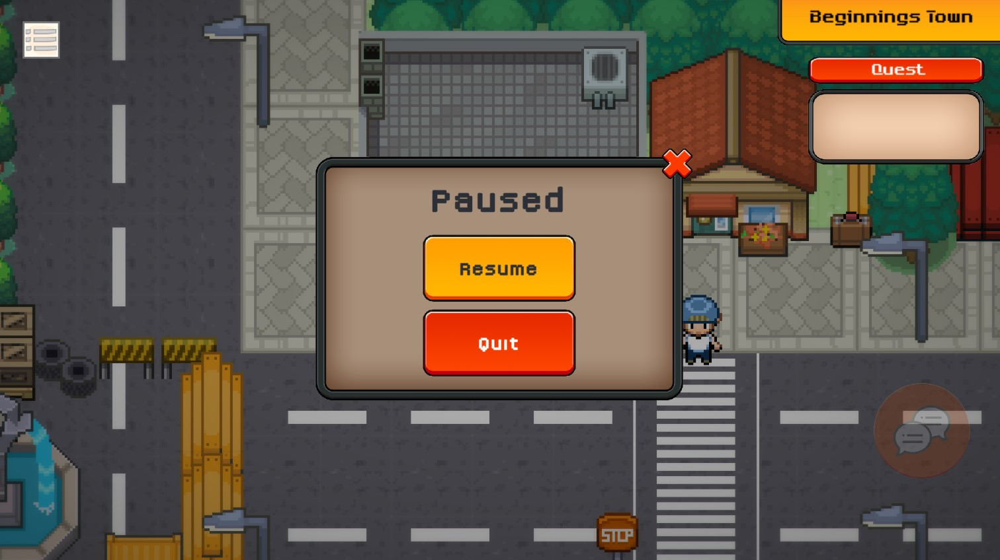
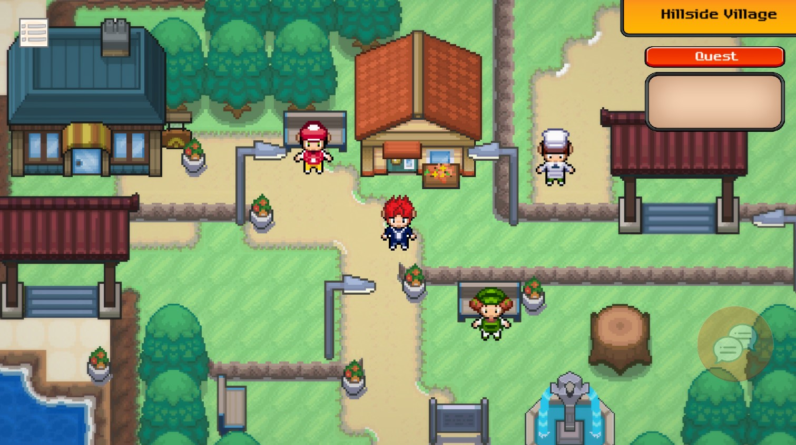
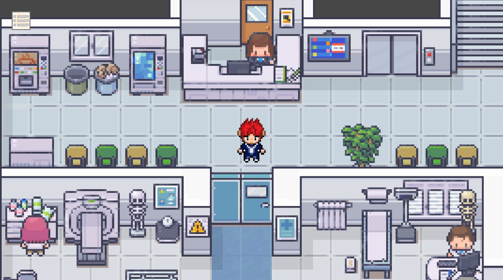

# Graduation-Project : Hi-Sensei

<b>Project name</b>  &nbsp&nbsp&nbsp&nbsp&nbsp Hi-Sensei เกมพัฒนาทักษะด้านคำศัพท์ภาษาญี่ปุ่นไฮ-เซนเซย์ (Hi-Sensei) 
<b>Project description</b>  &nbsp&nbsp&nbsp&nbsp&nbspHi-Sensei เป็นเกมเพื่อพัฒนาทักษะด้านคำศัพท์ภาษาญี่ปุ่น และการวางแผนจัดการ โดยใช้เกมเป็นสื่อกลางในการพัฒนาความรู้และทักษะด้านภาษาญี่ปุ่น 
<b>Team member</b>

- นาย ธนบดี ซันลี		        61130500045  thanabadee.sanlee@mail.kmutt.ac.th
- นาย รพีภัทร เพชรน้ำพลอย   61130500081  rapeepat.arm@mail.kmutt.ac.th
- นาย วรกันต์ ศุภวงศ์        61130500086  voragun.supawong@mail.kmutt.ac.th

<b>How to install program</b> 
<b>» WindowsOS «</b>
- ทำการเข้าไปที่ https://seniorproject.sit.kmutt.ac.th/ จากนั้นค้นหาโปรเจคที่ชื่อว่า “Hi-Sensei”
- ในส่วนของ Detail จะพบลิงค์สำหรับดาวน์โหลดเกม
- นำลิงค์ไปเปิดในแท็บใหม่ จะเข้าสู่หน้าเว็บที่เก็บไฟล์ไว้บน Google drive
- ทำการดาวน์โหลดไฟล์สำหรับระบบปฏิบัติการ Windows (For Windows.zip) ลงมาบนอุปกรณ์
- เปิดโฟลเดอร์ที่เก็บไฟล์ที่ดาวน์โหลดลงมาและทำการ Extract file 
- ในการเปิด Application ให้เลือกที่ไฟล์ชื่อว่า "Hi-Sensei.exe" จะเข้าสู่หน้าเริ่มต้นเกม

<b>Easy Trick!</b>
- เพื่อให้สะดวกต่อการเปิดใช้งานในครั้งถัดไปสามารถเพิ่มไฟล์ "Hi-Sensei.exe" ไปที่หน้า Desktop ได้ด้วยการคลิ๊กขวา --> Sent to --> Desktop (Create Shortcut)

<b>» macOS «</b>
- ทำการเข้าไปที่ https://seniorproject.sit.kmutt.ac.th/ จากนั้นค้นหาโปรเจคที่ชื่อว่า “Hi-Sensei”
- ในส่วนของ Detail จะพบลิงค์สำหรับดาวน์โหลดเกม
- นำลิงค์ไปเปิดในแท็บใหม่ จะเข้าสู่หน้าเว็บที่เก็บไฟล์ไว้บน Google drive
- ทำการดาวน์โหลดไฟล์สำหรับระบบปฏิบัติการ macOS (For macOS.zip) ลงมาบนอุปกรณ์
- เปิดโฟลเดอร์ที่เก็บไฟล์ที่ดาวน์โหลดลงมาและทำการ Extract file 
- ในการเปิด Application ให้เลือกที่ไฟล์ชื่อว่า "Complete Hi-Sensei [macOS]" จะเข้าสู่หน้าเริ่มต้นเกม

<b>Basic Start!</b>
- เมื่อเข้าสู่หน้าเริ่มต้นเกม (Start menu) จะพบปุ่ม Start กดที่ปุ่ม Start เพื่อเข้าสู่หน้าถัดไป
- เมื่อเข้ามาจะพบตัวเลือกในการเข้าสู่เกมในกรณีที่เป็นผู้เล่นใหม่ให้เลือก NEWGAME เพื่อเข้าสุ่หน้าการลงทะเบียน (Register) แต่ถ้าเป็นผู้เล่นที่เคยลงทะเบียนแล้วให้เลือก LOADGAME เพื่อทำการ LOGIN เข้าเล่นโดยไม่ต้องลงทะเบียนใหม่
- สำหรับผู้ที่เข้ามาเล่นครั้งแรกเมื่อเข้าสู่หน้าการลงทะเบียนให้ทำการกรอก ชื่อ(NAME), นามสกุล(SURNAME), อีเมล(EMAIL), พาสเวิร์ด(PASSWORD) เพื่อทำการลงทะเบียน ในการเข้าเล่นครั้งหน้าเพียงแค่ใช้อีเมลและพาสเวิร์ดที่ทำการลงทะเบียนไว้ในการเข้าเกมเป็นอันเสร็จสิ้น

 
 
 
 
